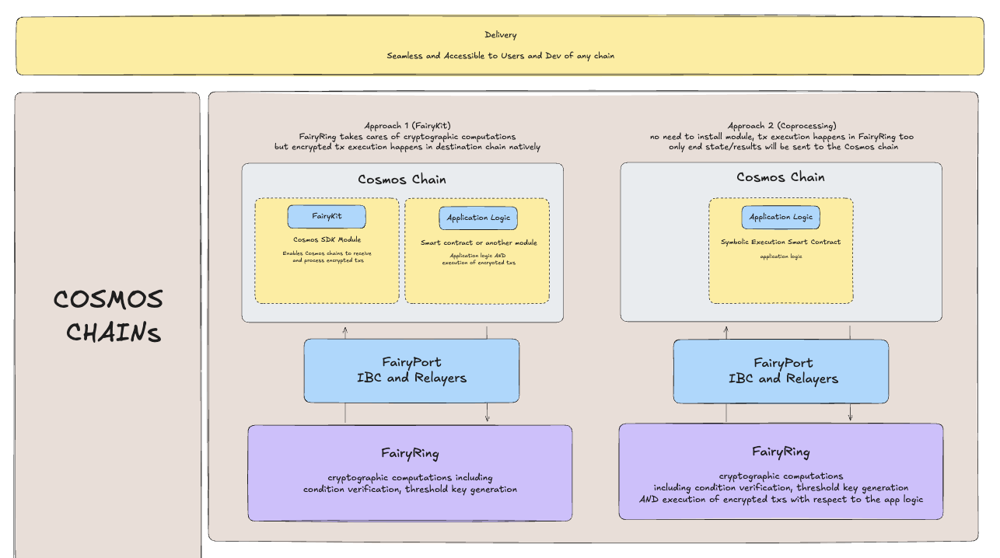

# Cosmos Chains Quickstarts

A key thing to understand is that there are various FairyKits to select from when integrating with Fairblock and Cosmos Chains.

A key design decision for which FairyKit method to choose revolves around the Decryption and Execution Layer.

Chains integrating with Fairblock can often choose between the "FairyKit" or "Co-Processing" route, as shown in the below schematic, where the two high-level integration categories, FairyKit and Coprocessing, are described. Depending on the design scenario, one method will prove to be better suited than the other.

A key aspect to note is that all of these integration methods provide the functionality to interact with FairyRing, and there can be underlying application logic working with these integrations.

At a more granular level, Cosmos FairyKit integrates using the following one or more of the following methods:

1. Module Integration
2. Smart Contract Integration
3. Underlying Execution Logic Integration
4. A Combination of Any of the Above

For example, the `privgov` tutorial covers a subset of the FairyKit methods available for Cosmos integration with Fairblock. Specifically, it is a combination of the underlying application logic and a mixture of the `x/pep` module details, that collectively construct today's `privgov` integration package.

These four methods can each be used to implement app logic integrating with FairyRing, even the application of interest today, `privgov`.
