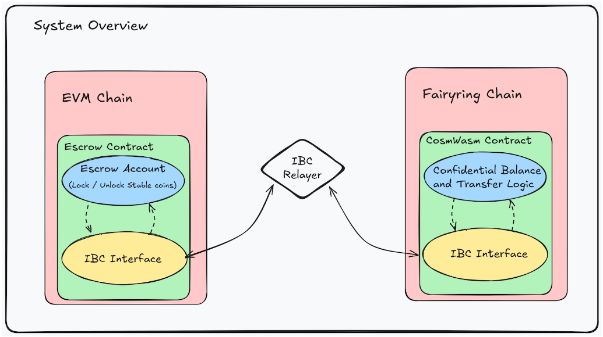
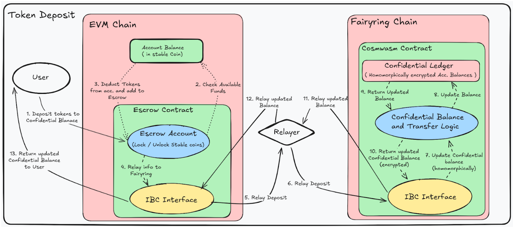
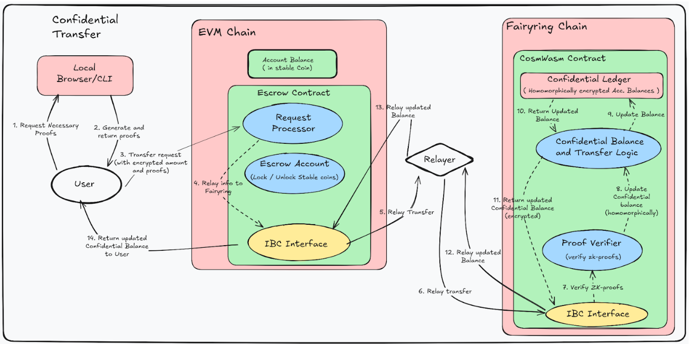
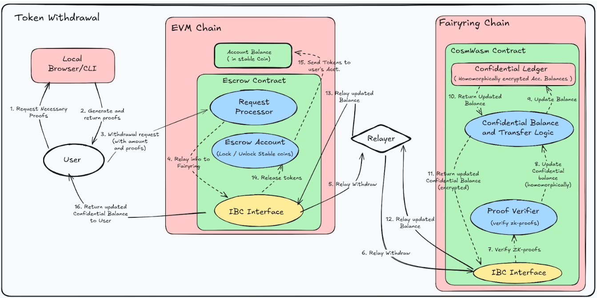

# Cross-Chain Confidential Transfers with FairyRing

## Introduction
Fairblock is a dynamic and decentralized network that hosts app-specific, secure, and performant confidential computing. This document describes the high-level architecture of a cross-chain confidential transfer system that connects existing EVM-based blockchains to FairyRing, Fairblock’s native chain that provides confidentiality to any system.

The objective is to enable confidential balances and transfers for tokens (e.g., stablecoins) issued or circulating on EVM chains, without requiring changes to the underlying token contracts or to user wallet behavior. Confidentiality is achieved by offloading privacy-sensitive logic to FairyRing, while settlement and liquidity remain on the originating EVM chain.

Cross-chain communication between EVM chains and FairyRing uses Inter-Blockchain Communication (IBC), which provides a light-client-based messaging channel. FairyRing does not rely on a single trusted execution environment (TEE) or MPC honest-majority assumptions for confidential transfers. Instead, FairyRing delivers confidential transfers by utilizing onchain lightweight additive homomorphic calculations and fast zero-knowledge (ZK)-proof verifications. It does not rely on fully homomorphic encryption over the discretized Torus (TFHE) from an off-chain coprocessor. All homomorphic calculations and ZK proof verification are extremely lightweight and executed onchain.

## System Overview
Each integrated EVM chain deploys a Solidity escrow contract that locks the underlying tokens. On FairyRing, a set of CosmWasm contracts maintains the confidential ledger and processes confidential transfers using lightweight homomorphic encryption and ZK proofs.

IBC connects the EVM environments and FairyRing. Each side runs a light client for the other chain, enabling state verification rather than trusting a centralized bridge. Off-chain relayers are responsible only for transporting packets. They cannot forge headers, modify proofs, or alter packet content.

Users deposit tokens into the EVM escrow, obtain an encrypted balance from FairyRing, perform confidential transfers with that balance, and optionally redeem to the EVM chain when they wish to withdraw.

## User Experience
The architecture is designed so that users only interact with their native EVM chain. The complexity of cross-chain messaging, ZK proofs, and homomorphic operations is abstracted away behind the deposit, transfer, and withdrawal flows.

### Deposit
To enter the confidential system, the user submits a standard EVM transaction to the escrow contract, sending the desired amount of tokens. The escrow contract locks these tokens and constructs an IBC packet that describes the deposit with the relevant metadata.

An IBC relayer observes this packet on the EVM side and forwards it to FairyRing. On FairyRing, a CosmWasm contract receives the packet, verifies it, and credits the user with an encrypted balance representing the deposited amount. Only encrypted token amounts are recorded on FairyRing. No plaintext balances are visible onchain.

FairyRing then sends a response packet back to the EVM chain through IBC. On receiving the response, the escrow contract updates its internal state so the user’s confidential position is accurately reflected on the EVM side as well. The user can then query the EVM escrow contract to view their confidential balance, without having to interact directly with FairyRing.

### Confidential Transfers
Once the user has an encrypted balance, they can perform confidential transfers to other confidential accounts while still transacting on their native EVM chain. To initiate a transfer, the user submits a transaction that includes an encrypted transfer amount and the necessary ZK proofs to the escrow contract. These proofs attest, among other things, that the sender’s balance is sufficient, that the transfer preserves total value, and that no negative balances are created as a result of the operation.

The escrow contract wraps this information into an IBC packet. A relayer carries the packet to FairyRing, where the CosmWasm contract verifies the ZK proofs. If the proofs are valid, FairyRing updates the encrypted balances of both sender and the receiver using homomorphic addition/subtraction, all without revealing the underlying token amounts.

FairyRing then sends a response packet back via IBC. Once processed on the EVM side, the escrow contract updates its view of the confidential balances for both parties, allowing users to query the escrow contract and observe that their confidential balances have changed.

### Withdrawal
When the user wishes to redeem their confidential balance in native stablecoins, they can submit another transaction to the escrow contract with the amount and a ZK proof showing sufficient tokens in their confidential balance.

The escrow contract constructs an IBC packet for this withdrawal request and emits it. A relayer forwards the packet to FairyRing, where the CosmWasm contract verifies the proof and updates the user’s encrypted balance accordingly.

FairyRing then returns a response packet to the EVM chain. When the escrow contract processes this response, it updates its internal state and releases the corresponding amount of locked tokens back to the user’s EVM address.

Throughout this lifecycle, the user interacts only with the EVM escrow contract. Deposits, confidential transfers, and withdrawals all appear as conventional EVM transactions, while cryptography and cross-chain coordination occur under the hood.

## Architectural Components
### FairyRing: Confidentiality Provider
FairyRing operates as a dedicated confidentiality execution layer. Its core logic is implemented as CosmWasm contracts that maintain a confidential ledger of encrypted balances per account and per asset. These contracts process confidential transfers based on ZK proof verification and lightweight homomorphic addition/subtraction, ensuring that all balance updates are internally consistent while never exposing the underlying amounts.

FairyRing also supports selective disclosure. Users decrypt their balances locally with their own keys, while only encrypted amounts are stored onchain. When required (for example, for compliance, audits, or investigations), auditors can be granted access to scoped decryption keys. This is enabled by FairyRing’s threshold identity-based encryption (IBE), which allows specific accounts or transaction subsets to be revealed under well-defined conditions without compromising global confidentiality.

### EVM Escrow Contract
On each EVM chain, a dedicated escrow contract serves as the bridge endpoint and local interface for users. Its primary functions are to lock and unlock tokens and to interface with IBC.

When a user deposits tokens, the escrow contract locks these funds and emits an IBC packet to FairyRing. When a valid IBC response is received from FairyRing (for example, confirming a successful transfer or withdrawal), the contract updates its internal state and, in the case of withdrawals, releases the corresponding tokens back to the user.

The escrow contract is intentionally minimal in logic. It handles token accounting and the IBC packet interface but avoids complex cryptographic operations. Heavy cryptographic verification and homomorphic balance management are delegated to FairyRing.

### IBC Relaying
IBC provides trust-minimized communication between EVM chains and FairyRing. Each chain maintains a light client of the other, allowing it to verify headers and proofs accompanying incoming packets. Off-chain relayers merely move packets between chains; they do not participate in validation and cannot forge valid headers, tamper with proofs, or undetectably alter packet contents.

As a result, the security of cross-chain communication is ultimately anchored in the consensus of the connected chains themselves rather than in any external custodian or relayer.

## Leveraging the Confidentiality Provided by FairyRing
FairyRing provides the ability to make confidential transfers both natively as well as externally. Natively, developers can build confidential applications (cApps) directly on FairyRing. FairyRing is a self-sufficient chain that can host its own native cApps. At the same time, FairyRing can provide similar levels of confidentiality to external chains and systems seamlessly via IBC or relayers.

### Stabletrust: The Complete Confidential Package
Stabletrust is the browser-based frontend provided by Fairblock for making confidential payments and transfers. It includes wallet integrations, browser-based local ZK proof generation, balance decryption, and the ability to transact on FairyRing or any chain that uses FairyRing for confidential transfers. It is a pre-built solution that can be used directly by both FairyRing users and users on different chains. Users on other chains do not need to interact with FairyRing directly to use confidential transfers. Stabletrust comes with built-in wallet integrations, which allow users to log in to their accounts on the chains they already use and make transactions without bridging funds. Stabletrust is an all-in-one interface for users on any chain to start making confidential transfers immediately without any prior setup or knowledge.

### Custom Integrations
FairyRing has been designed to be a chain-agnostic confidentiality provider, which means it can extend its functionality to other ecosystems (e.g. EVM, Solana, etc.) seamlessly via IBC or custom relayers. Note that, when providing confidentiality to external ecosystems, no cross-chain token transfer is necessary. FairyRing simply acts as the core confidential execution layer and keeper of confidential ledgers.

Developers can build bespoke user interfaces and applications using the available tools provided by Fairblock. APIs are available for submitting transactions and querying the native chain. Command-line utility and JavaScript packages support local ZK proof generation and balance decryption. Finally, developers can simply follow the wallet integration guide (as implemented in Stabletrust) to have their complete user interface, which runs on their native chain, with FairyRing as the confidential execution layer. The APIs and tools provided allow for seamless integration with not only browser-based frontends, but also anything from Telegram and Discord bots to AI agents.

### Native Solutions
While IBC provides trustless relaying between chains, custom relayers are available for IBC-incompatible systems. For systems/chains that prefer a native confidentiality solution, Fairblock can also provide custom integration.
