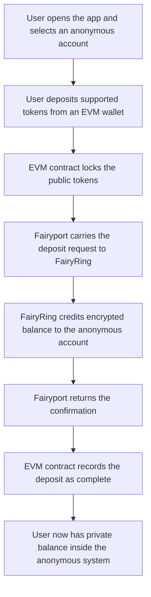
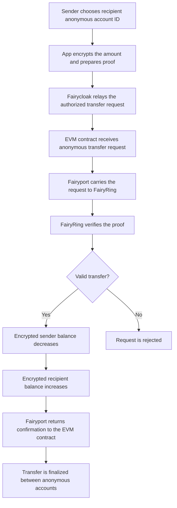
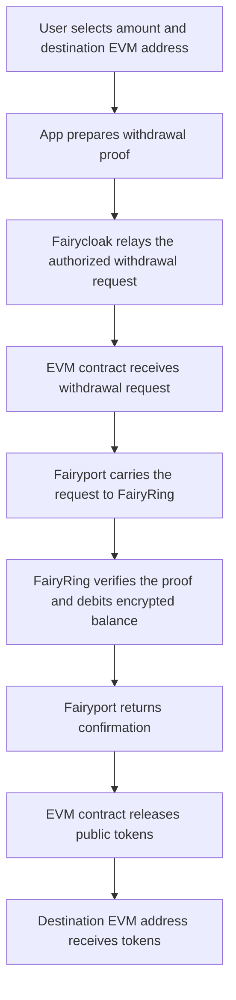

# Technical Overview

## Cross-Chain Confidential Transactions with FairyRing
Fairblock is a decentralized network for app-specific, secure, and performant confidential computing. This document describes a high-level architecture for cross-chain confidential transaction system that connects existing EVM blockchains to FairyRing, Fairblock’s native chain and confidentiality execution layer.

The objective is to enable confidential balances and transactions for tokens (e.g., stablecoins) issued or circulating on EVM chains without requiring changes to the underlying token contracts and without changing user wallet behavior. Confidentiality is achieved by offloading privacy-sensitive logic to FairyRing, while settlement and liquidity remain on the originating EVM chain.

Cross-chain communication between EVM chains and FairyRing uses Inter-Blockchain Communication (IBC), a light-client-based messaging channel. This design avoids relying on a single trusted execution environment (TEE) or MPC honest-majority assumptions. Instead, confidential transfers use lightweight additive homomorphic calculations and fast zero-knowledge (ZK)-proof verification, executed within the protocol flow. The system does not rely on fully homomorphic encryption over the discretized Torus (TFHE) from an off-chain coprocessor. All homomorphic calculations and ZK proof verification are extremely lightweight, and execution runs on FairyRing.

## System Overview
Each integrated EVM chain deploys a minimal Solidity escrow contract that locks underlying tokens. On FairyRing, a set of CosmWasm contracts maintains a confidential ledger and processes encrypted balance transitions using lightweight homomorphic operations and ZK proofs.

IBC connects the EVM environment and FairyRing. Each side runs a light client of the other chain to enable state verification rather than trusting a centralized bridge. Off-chain relayers are responsible only for transporting packets. They cannot forge headers, modify proofs, or alter packet contents.

Users deposit tokens into the EVM escrow, receive a confidential balance from FairyRing, perform confidential transactions with that balance, and optionally redeem back to the EVM chain when withdrawing.

## User Experience
The architecture is designed so that users interact only with their native EVM chain. The complexity of cross-chain messaging, ZK proofs, and homomorphic operations is abstracted behind the deposit, transfer, and withdrawal flows.

### Deposit
To enter the confidential system, a user submits a standard EVM transaction to the escrow contract, sending the desired amount of tokens. The escrow locks the tokens and constructs an IBC packet describing the deposit with the relevant metadata.

An IBC relayer observes this packet on the EVM side and forwards it to FairyRing. A CosmWasm contract receives the packet, verifies it, and credits the user with an encrypted balance representing the deposited amount. Only encrypted values are recorded on FairyRing. No plaintext balances are visible onchain.

FairyRing returns a response packet back to the EVM chain through IBC. On receiving the response, the escrow contract updates its internal state so the user’s confidential position is accurately reflected on the EVM side. The user can query the EVM escrow contract to view their confidential balance, without interacting with FairyRing directly.

### Confidential Transactions
Once the user has an encrypted balance, they can transfer to other confidential accounts while still transacting on the EVM chain. To initiate a transfer, the user submits a transaction to the escow contract that includes an encrypted transfer amount and the necessary ZK proofs. These proofs attest, among other things, that the sender’s balance is sufficient, that the transfer preserves total value, and that no negative balances are created as a result of the operation. The transfer transaction requires the user to pay a small fee (currently set to 1 wei) which will be publicly visible and does not leak any information about the transfer amount. 

The escrow contract wraps this payload into an IBC packet. A relayer forwards it to FairyRing, where a CosmWasm contract verifies the ZK proofs. If the proofs are valid, FairyRing updates the encrypted balances of both sender and the receiver using homomorphic addition/subtraction, without revealing the underlying token amounts.

FairyRing then returns a response packet via IBC. Once processed on the EVM side, the escrow contract updates its view of the confidential balances for both parties, allowing users to query the escrow contract and observe that their confidential balances have changed.

### Withdrawal
When the user wishes to redeem their confidential balance to native stablecoins, they can submit a transaction to the escrow contract with the withdrawal amount and a ZK proof showing sufficient confidential balance.

The escrow contract constructs an IBC packet for this withdrawal request and emits it. A relayer forwards the packet to FairyRing, where the CosmWasm contract verifies the proof and updates the encrypted balance accordingly.

FairyRing then returns a response packet to the EVM chain. The escrow contract processes it and updates its internal state and releases the corresponding amount of locked tokens back to the user’s EVM address.

Throughout this lifecycle, the user interacts only with the EVM escrow contract. Deposits, transfers, and withdrawals appear as conventional EVM transactions, while cryptography and cross-chain coordination occur under the hood.

## Anonymous Confidential Transfer
Anonymous Confidential Transfer extends the confidential transfer model by protecting not only the transaction amount, but also the public wallet identity involved in day-to-day transfers. In a standard confidential transfer, the amount is encrypted, but the sender and receiver are still represented by their public wallet addresses. Anonymous Confidential Transfer separates the confidential account from the public wallet, so users can transfer privately without exposing which EVM address is sending or receiving inside the confidential system.

The main idea is simple. A user holds funds in an anonymous confidential account instead of holding them directly under a visible wallet address. This account is identified by an account ID that is independent of the user's public EVM address. The user keeps the private keys needed to control and decrypt their own balance locally. The chain only stores encrypted balances and public information required to verify that each operation is valid.

### How the Flow Works
The lifecycle starts when a user creates or selects an anonymous account. This account has its own cryptographic identity inside the confidential system. The user can then move supported tokens into the anonymous transfer system. The underlying tokens are locked on the EVM side, while the corresponding confidential balance is created inside the anonymous account. A deposit is the entry point into the system and may still appear as a public funding action on the EVM chain. Once the funds are credited into the anonymous account, activity inside the anonymous system is based on the anonymous account, not on the user's public wallet address.

When the user wants to send funds, they enter the recipient's anonymous account ID and the transfer amount in the application. The amount is encrypted before it is submitted. The application also prepares a proof that shows the transfer is valid. This proof confirms important facts, such as the sender having enough balance and the transfer preserving the correct amount of value, without revealing the actual balance or transfer amount.

The transfer request is then submitted through Fairycloak. Fairycloak acts as the relay layer for anonymous confidential operations. Instead of the user broadcasting every anonymous transfer directly from their own wallet, Fairycloak submits the operation to the EVM contract on the user's behalf. This helps keep the user's public wallet address separate from the anonymous transfer activity. Fairycloak pays the gas required for these operations and is compensated through the protocol's fee flow. Importantly, Fairycloak does not need to know the private transfer amount, cannot change the encrypted balance update, and cannot make an invalid transfer pass verification.

Once the request reaches the EVM contract, it is passed into the Fairblock confidentiality flow. Fairyport carries the request between the EVM chain and FairyRing. Fairyport is responsible for moving the request and response messages across chains. It does not decide whether a transfer is valid, does not control user funds, and does not gain access to the hidden amount. Its role is transportation and coordination between the connected chain and FairyRing.

FairyRing performs the confidential execution. It verifies the proof attached to the transfer request and updates the encrypted balances if the transfer is valid. The sender's encrypted balance is reduced and the recipient's encrypted balance is increased, but the plaintext amounts are never published onchain. The recipient can later decrypt their own balance locally using their own keys.

After FairyRing processes the request, a response is returned to the EVM side through Fairyport. The EVM contract updates the state of the anonymous transfer request accordingly. From the user's perspective, the result is a private transfer between anonymous accounts. Public observers can see that protocol activity happened, but they do not see the transferred amount or a direct sender and receiver wallet pair for the anonymous transfer.

### Simplified Flow Diagrams
The diagrams below show the three main user flows at a high level. They are intentionally simplified and focus on what happens from the user's point of view, rather than on low-level relayer behavior or implementation details.

#### Anonymous Deposit
A deposit moves tokens from a public EVM wallet into an anonymous confidential account. The public tokens are locked on the EVM side, and the anonymous account receives a corresponding encrypted balance inside the confidential system.

#### Anonymous Transfer
An anonymous transfer moves value between two anonymous accounts. The amount is encrypted, the proof shows that the transfer is valid, and Fairycloak helps submit the request without linking routine transfer activity directly to the user's public wallet transactions.

#### Anonymous Withdrawal
A withdrawal exits the anonymous layer. The anonymous account balance is debited privately, then the EVM contract releases the corresponding public tokens to the selected destination address.

### Withdrawals from Anonymous Accounts
Users can also withdraw from an anonymous account back to a public EVM address. A withdrawal intentionally converts part of the private balance back into public tokens. The user prepares a withdrawal request and a proof showing that the anonymous account has enough balance. Fairycloak relays the request, FairyRing verifies the proof and debits the encrypted balance, and the EVM contract releases the corresponding tokens to the chosen destination address.

The withdrawal destination is public because the tokens are being released on a public EVM chain. This is an important distinction. Anonymous Confidential Transfer protects activity inside the confidential system, but a withdrawal creates a public onchain payment to the selected address. Users and applications should treat withdrawals as the point where value exits the anonymous layer and becomes visible again on the destination chain.

### Role of Fairycloak
Fairycloak is the user-facing relay layer for anonymous confidential transfers. Its main purpose is to prevent routine anonymous operations from being directly tied to the user's public wallet transactions. It receives user-authorized requests, submits them to the EVM contract, and handles the gas payment for relayed operations.

Fairycloak improves privacy and usability at the same time. Users do not need to manage gas for every anonymous transfer, and public observers do not see the user's wallet submitting each private operation. Fairycloak is still not trusted with the user's funds or secrets. The actual validity of each operation is enforced by cryptographic proofs and by the contracts that process them.

### Role of Fairyport
Fairyport connects the EVM side of the system with FairyRing. For anonymous confidential transfers, it carries requests from the EVM contract to FairyRing and returns the result back to the EVM contract. This allows the EVM chain to remain the user's familiar settlement environment while FairyRing provides the confidential execution layer.

Fairyport is a relayer, not a decision maker. It cannot create valid transfers by itself, cannot decrypt private balances, and cannot alter the result of a transfer without detection. The protocol relies on verified messages and contract checks, while Fairyport provides the communication path needed to complete the flow.

### Privacy and Control
Anonymous Confidential Transfer is designed around three practical privacy goals. First, transfer amounts remain encrypted. Second, the sender and recipient inside the anonymous transfer system are represented by anonymous account IDs rather than public wallet addresses. Third, relayed execution through Fairycloak reduces the visible link between a user's wallet and their anonymous transfer activity.

Control remains with the user. The user keeps the keys needed to access and decrypt their own confidential balance. The protocol verifies transfers without exposing the private financial details behind them. If compliance controls are enabled for a deployment, specific anonymous accounts can be restricted according to the application's policy without exposing all user balances or weakening confidentiality for the entire system.

## Architectural Components
### FairyRing: Confidentiality Provider
FairyRing operates as a dedicated confidentiality execution layer. Its core logic is implemented as CosmWasm contracts that maintain a confidential ledger of encrypted balances per account and per asset. These contracts process confidential transactions based on ZK proof verification and lightweight homomorphic addition/subtraction, ensuring that all balance updates are internally consistent while never exposing the underlying amounts.

FairyRing also supports selective disclosure under defined conditions. Users decrypt their own balances locally with their own keys, while only encrypted amounts are stored onchain. When required for compliance, audits, or investigations, authorized parties can be granted access to scoped decryption keys. This is enabled by FairyRing’s threshold identity-based encryption (IBE), which allows specific accounts or transaction subsets to be revealed under well-defined conditions without introducing a single persistent audit key that compromises global confidentiality.

### EVM Escrow Contract
On each EVM chain, a dedicated escrow contract serves as the bridge endpoint and local interface for users. Its primary functions are to lock and unlock tokens and to interface with IBC.

When a user deposits tokens, the escrow contract locks the funds and emits an IBC packet to FairyRing. When a valid IBC response is received from FairyRing (for example, confirming a successful transaction or withdrawal), the contract updates its internal state and, in the case of withdrawals, releases the corresponding tokens back to the user.

The escrow contract is intentionally minimal in logic. It handles token accounting and the IBC packet interface but avoids complex cryptographic operations. Heavy cryptographic verification and homomorphic balance management are delegated to FairyRing.

### IBC Relaying
IBC provides trust-minimized communication between chains and FairyRing. Each chain maintains a light client of the other, allowing it to verify headers and proofs accompanying incoming packets. Off-chain relayers merely move packets between chains; they do not participate in validation and cannot forge valid headers, tamper with proofs, or undetectably alter packet contents.

As a result, the security of cross-chain communication is ultimately anchored in the consensus of the connected chains rather than in any external custodian or relayer.

## Leveraging the Confidentiality Provided by FairyRing
FairyRing provides the ability to make confidential transactions both natively and externally. Natively, developers can build confidential applications (cApps) directly on FairyRing. FairyRing is a self-sufficient chain that can host its own native cApps. At the same time, FairyRing can provide similar levels of confidentiality to external chains and systems seamlessly via IBC or relayers.

### Stabletrust: The Complete Confidential Package
Stabletrust is Fairblock's browser-based interface for confidential payments and transfers. It includes wallet integrations, browser-based local ZK proof generation, balance decryption, and the ability to execute on FairyRing or chain that uses FairyRing for confidential transactions. It is a pre-built solution that can be used directly by both FairyRing users and users on different chains. Users on other chains do not need to interact with FairyRing directly. Stabletrust comes with built-in wallet integrations, which allow users to log in to their accounts on the chains they already use and make transactions without bridging funds. Stabletrust is an all-in-one interface to start making confidential transactions immediately without any prior setup or crytography knowledge.

### Custom Integrations
FairyRing is chain-agnostic and can extend confidentiality to other ecosystems (e.g. EVM, Solana, Stellar, etc.) seamlessly via IBC or custom relayers. No cross-chain token transfer is required. FairyRing acts as the core confidential execution layer and keeper of confidential ledgers.

Developers can build bespoke user interfaces and applications using the available tools provided by Fairblock. APIs are available for submitting transactions and querying the native chain. Command-line utility and JavaScript packages support local ZK proof generation and balance decryption. Finally, developers can simply follow the wallet integration guide (as implemented in Stabletrust) to have their complete user interface, which runs on their native chain, with FairyRing as the confidential execution layer. The APIs and tools provided allow for seamless integration with not only browser-based frontends, but also anything from Telegram and Discord bots to AI agents.

### Native Solutions
While IBC provides trustless relaying between chains, custom relayers are available for IBC-incompatible systems. For systems and chains that prefer a native confidentiality implementation, Fairblock can provide custom integrations.
