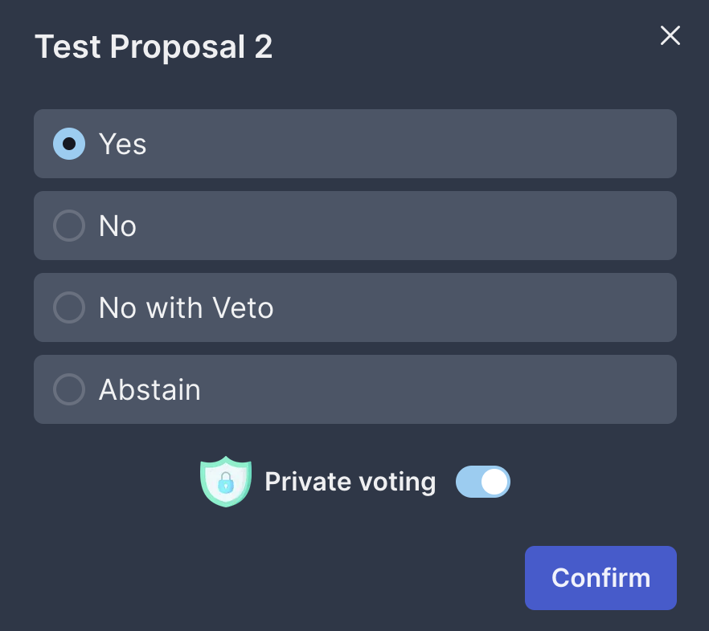

# Private Governance

In this tutorial, you will learn how to implement private governance voting on your frontend application.



## Installing packages

To submit an encrypted voting on your frontend application, you will need to install [this](https://www.npmjs.com/package/ts-ibe) encryption package.

Using npm:

```bash
npm install ts-ibe
```

Using yarn:

```bash
yarn add ts-ibe
```

Using pnpm:

```bash
pnpm add ts-ibe
```

## Prepare voting data

From each proposal, you can get `identity` and `publicKey`. It takes a few blocks for the IBC response to come though. We assume that your application chain has already been integrated with our private governance module.

And, you can get `voting option` from the validator's input.

```typescript
const voteOption: DecryptedVoteOption = {
  option: voteOptionFromJSON(option),
  randomNo: getNowTimestamp(), // any random number you generated
};

const voteOptionBytes = DecryptedVoteOption.encode(voteOption).finish();
```

## Encrypt voting data

To submit a private vote, you will need to encrypt the above data you prepared.

```typescript
import { timelockEncrypt } from 'ts-ibe';

...

const encryptedVotingData = await timelockEncrypt(identity, publicKey, voteOptionBytes);

```

## Submit the encrypted voting data

Finally, you can submit the encrypted voting data.

```typescript
await client.CosmosGovV1.tx.sendMsgVoteEncrypted({
  value: {
    proposalId,
    voter: address,
    encryptedData: encryptedVotingData,
    metadata: 'Private vote',
  },
});
```
