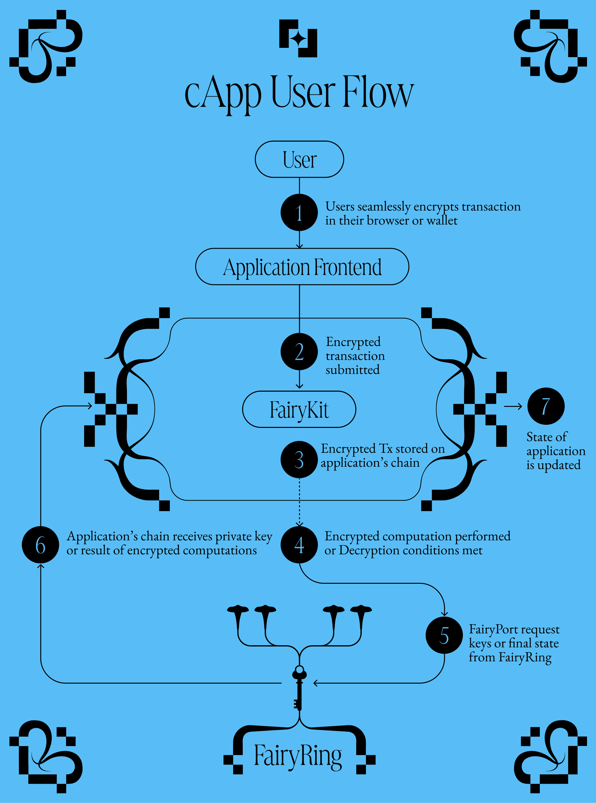

# v1 Network

The `fairyring` chain unlocks novel capabilities for Apps and other blockchains.

> **Apps refer to applications living on EVMs, and/or blockchains themselves, like those in the cosmos ecosystem.**

<!-- This is in the quickstart already, but I think it's good to repeat it here to help prime the topics of the network -->

When integrating with `fairyring` chain, Apps carry out active communication with the chain. This section will detail the core fundamentals, occurring beneath this integration.

## Sequenced Steps When Integrating with `fairyring`

<!-- TODO: assess if this section needs to be here, or can be combined into the high level architecture page -->

The core fundamentals can be seen in sequenced steps with the below schematic.

1. **Setup:** Setup of `fairyring` `x/pep` module within the blockchain hosting the App (including the use of pre-compiles for some EVMs) are carried out to enable communication with the `fairyring` chain.
2. **Encrypt Transaction for later Execution:** Apps listens to the `fairyring` for new Master Public Keys (MPKs) to encrypt their respective transactions. To encrypt a transaction the Apps also obtains a unique id from `fairyring` corresponding to its respective chain and transaction details.
3. **Conditional Decryption:** `fairyring` awaits notification of a respective condition, by default it is a transaction-specific `fairyring` block height. Once it is notified, a decryption key (keyshare) is automatically generated by the `fairyring` validators.
4. **App Decryption and Execution:** `fairyring` shares the newly generated keyshare to the respective chain to decrypt the transaction at the beginning of the block. This is done in order to avoid risks arising from delayed execution.

The above sequence is carried out by the integration and use of two modules mainly:

1. `x/pep module` - On both the `fairyring`, and the respective blockchain or EVM, it handles all things related to encrypted transactions.
2. `x/keyshare module` - Only on `fairyring`, it handles all things related to threshold IBE key generation.

You can find more details on both modules and more in the [Advanced](../../../category/advanced) section.
