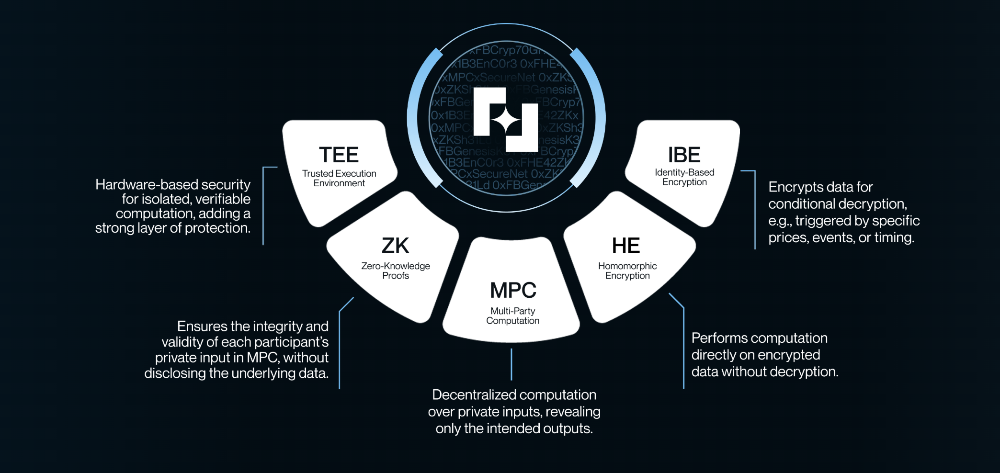

# Fairblock and Cryptography

Simplicity is the ultimate form of art. We prioritize simplicity and usability through a multimodal, dynamic design fine-tuning performance and security, and introducing complexity only when essential.

Fairblock leverages DKG and threshold IBE (sometimes referred to as conditional decryption) for applications that require pre-execution confidentiality such as sealed-bid auctions, protected trading, selective disclosure, and AI private data marketplaces achieving minimal bandwidth and computation overhead. For applications requiring computation over encrypted transactions or private data such as confidential stablecoins, private AI inference, and dark pools we employ advanced MPC and HE schemes, including Twisted ElGamal, threshold FHE (CKKS), and SPDZ. We optimize our TPS and avoid unnecessaery security assumptions, bandwidth overhead, and preprocessing steps by optimizing our cryptographic schemes for each application e.g. 1. there's no need to rely on a single TEE's fragile security, when HE is fast enough for confidenital transfers 2. there's no need to use a general-purpose slow TFHE (trusting centralized coprocessors) for DeFi, sealed-bid auctions, or confidential transfers 3. For confidential AI inference, general-purpose TFHE is not effcient enough, we have to focous on other FHE/MPC solutions like CKKS/SPDZ, or embrace GPU-TEEs with MPC security.

Integrating TEEs with MPC schemes reduces reliance on a single TEE’s hardware security guarantees while lowering the probability of collusion required to compromise an MPC protocol’s honest-majority assumption. Additionally, ZKPs are used in select MPC applications to ensure the validity of private inputs when multiple parties interact within a shared private state.

Fairblock's V1 is live with two main schemes:

1. Lighweight HE for confidential transfers
2. MPC-IBE for pre-execution confidentiality and conditional decryption (Frontrunning protection, protected limit orders, sealed-bid auctions, selective disclosure for transfers, predictions)

