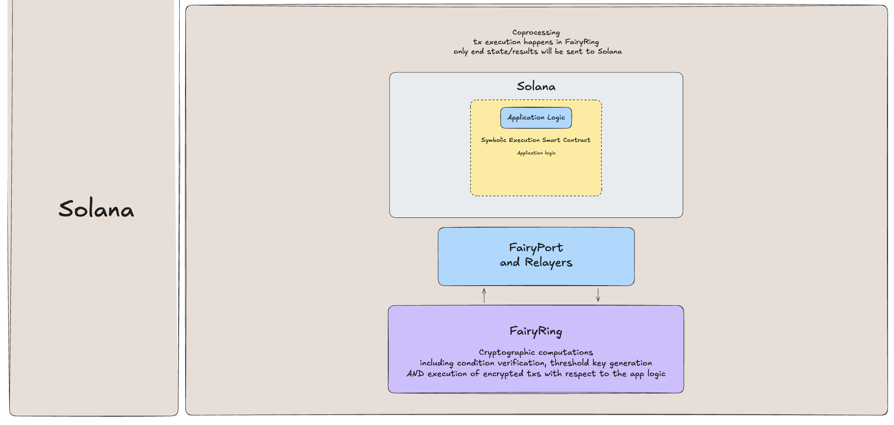

# High-Level Architecture

> **Apps refer to applications living on EVMs, and/or blockchains themselves, like those in the cosmos ecosystem.**

When Apps integrate with Fairblock, they have active communication with the FairyRing chain, either as an app hosted by FairyRing or an App or Chain working with FairyRing. This page goes over building apps hosted by the FairyRing network itself, the high-level architecture of an App on a network other than FairyRing, and introduces the external chain integration packages referred to as FairyKits.

## Building Apps on FairyRing

Before jumping into the architecture typically seen with integrating with external chains, it is important to highlight the following:

1. The FairyRing network is a Cosmos chain itself. It holds a number of novel features. Among the most important is that no relayers are needed since the confidential computation, and contract call-back are native functions of the hosting chain itself. Apps built within FairyRing benefit from more performant operations.

2. FairyRing frictionlessly integrates with any chain. Having an interconnected environment of chains deepens liquidity and ultimately makes FairyRing as a network more robust.

Below you can see a high-level schematic of how an App exists within the FairyRing network.

With that basic understanding of how apps can be hosted within FairyRing, and its benefits, let's talk about how other chains can integrate with it.

## Typical Components with Chains Integrating with FairyRing

The high-level architecture and components involved in most integrations are listed below and correspond to the FairyRing schematic shared too. Links to more information on each are provided for easier reference as well:

<!-- TODO: get links to all of the below except Destination Chain -->

1. FairyRing - Fairblock's native chain and ecosystem, that abstracts away intensive cryptographic operations for applications built within its chain as well as those built on alternative blockchains. For example, some functionality in today's FairyRing testnet includes the tIBE-based generation and distribution of decentralized keys to other chains.
2. FairyKit - Integration packages that plug into any protocol and application to bring one-click confidentiality to any app or user requiring it.
3. [Encryption SDK](../advanced/encrypt_tx.md) - An off-chain software used to encrypt transactions to be submitted to the Destination Chain. Once the encrypter is integrated with applications (front-end or wallets), users will seamlessly encrypt their transactions. Encryption happens, end-to-end, locally within the browser and is not relying on any third parties.
4. Destination Chain - The chain storing encrypted transactions, receiving public keys, and secret keys from FairyRing, and where the transactions are executed. This can be FairyRing itself with native applications to its chain, or it can be an external chain working with FairyRing.
5. [Relayers](../advanced/fairyport.md) - The communication method that listens and coordinates between the FairyRing and destination chains for transaction decryption and execution. An example of this includes FairyPort and IBC.

_To learn more about the concepts above, read more in the [learn](../learn/v1/v1.md) and respective [advanced](../advanced/) sections._

## FairyKits and Co-Processing

There are two main routes for chains integrating with Fairblock.

1. The use of "FairyKits" specific to the blockchain that is integrating with Fairblock. This allows for custom setups where the partnering network could carry out some or all of the Decryption and Execution.
2. The "Co-Processing" route where FairyRing carries out the decryption, execution, and simply sends the end state to the integrating network.

Depending on the design scenario, one method will prove to be better suited than the other.

> **There are different FairyKits for Cosmos, EVMs, and RustVMs. Fairblock can integrate with any network!**

Below are schematics outlining the different integration methods at a high level for various networks.

A key aspect to note is that all of these integration methods provide the functionality to interact with FairyRing, and there can be underlying application logic working with these integrations.

Now that you have a high level understanding of the architecture and the integration options, make sure to check out the quick start tutorials for the chain you're working with!
