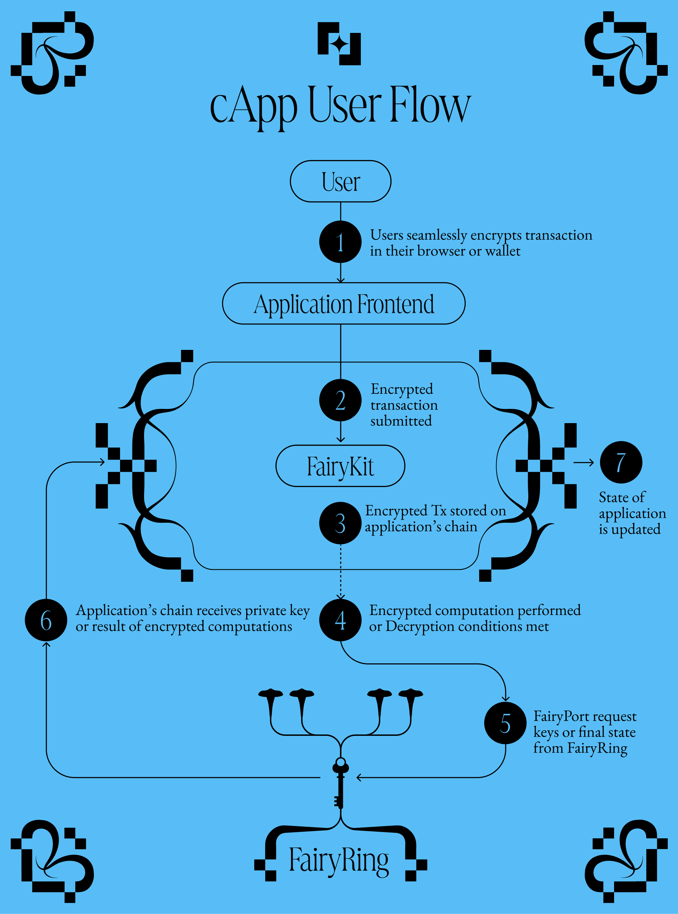

# Fairblock High-Level Architecture

> **Apps refer to applications living on EVMs, and/or blockchains themselves, like those in the cosmos ecosystem.**

When Apps integrate with Fairblock, they have active communication with the Fairyring chain. This communication is the foundation to the transaction flow. This page goes over the high-level architecture, and introduces the integration packages referred to as FairyKits.

**Typical Components**

The high level architecture and components involved in most integrations are listed below and correspond to the FairyRing schematic shared too. Links to more information on each are provided for easier reference as well:

<!-- TODO: get links to all of the below except Destination Chain -->

1. Fairyring - Fairblock's native chain and ecosystem, that also provides decentralized keys for encryption and decryption to other chains.
2. [Encryption SDK](../../advanced/encrypt_tx.md) - An off-chain software used to encrypt transactions to be submitted to the Destination Chain. Once the encrypter is integrated with applications (front-end or wallets), users will seamlessly encrypt their transactions. Encryption happens, end-to-end, locally within the browser and is not relying on any third parties.
3. `fairy` module - Developers can simply install this module to empower their blockchains and/or EVM apps to receive and process encrypted transactions. To be more specific, this module's takes care of receiving and storing encrypted transactions, decryption, verification, and execution within Destination Chains.
<!-- TODO: make a new sub page in advanced for `fairy` module -->
4. [Fairyport](../../advanced/fairyport.md) - An off-chain software that actively listens and coordinates between the Fairyring and destination chains for transaction decryption and execution.
5. Destination Chain - The chain storing encrypted transactions, receiving public keys, and secret keys from Fairyring, and where the transactions are executed. This can be Fairyring itself with native applications to its chain.

_To learn more about the concepts above, read more in the [learn](../learn/overview.md) and respective [advanced](../category/advanced/) sections._

There are two main routes for chains integrating with Fairblock.

1. The use of "FairyKits" specific to the blockchain that is integrating with Fairblock. This allows for custom setups where the partnering network could carry out some or all of the Decryption and Execution.
2. The "Co-Processing" route where FairyRing carries out the decryption, execution, and simply sends the end state to the integrating network.

Depending on the design scenario, one method will prove to be better suited than the other. 

> **There are different FairyKits for Cosmos, EVMs, and RustVMs. Fairblock can integrate with any network!**

A key aspect to note is that all of these integration methods provide the functionality to interact with Fairyring, and there can be underlying application logic working with these integrations.

Now that you have a high level understanding of the architecture and the integration options, make sure to check out the quick start tutorials for the chain you're working with!