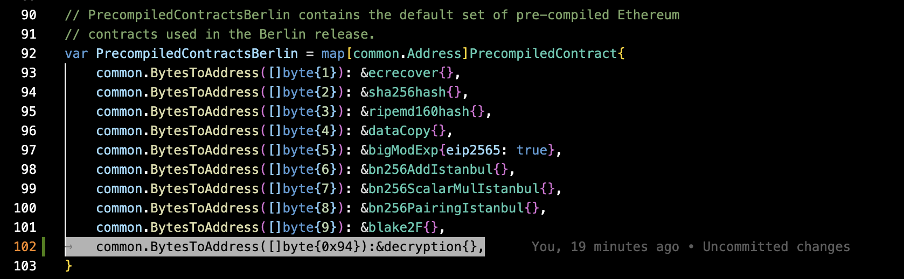

# EVMs Modified with Pre-Compiles

This page is under progress and will be updated shortly.
<!-- 
<!-- TODO - have a disclaimer on every page, or at least the quickstart / build pages that these walk throughs are not production ready, and are purely for educational purposes. -->

<!-- Outline for this page:
1. Diagram for how new chain interacts with Fairyring -->

The point of this quickstart: create your first app using Fairyring for encryption and conditional decryption in less than 30 minutes. Throughout this, we'll repeat context on how fairblock interacts with blockchains and apps. 

The key checkpoints for this quickstart are:

1. Setup a custom EVM w/ precompiles and compile the docker image.
2. Compile the new docker image with the WASM Module Root updated to respect the precompile changes. 
3. Deploy the base contracts for a new orbit chain and register it on the Arbitrum Sepolia Testnet.
4. Use newly obtained config files to update your local orbit chain codebase. This will ensure you are communicating with it properly in your local environment.
5. Run your docker image for the orbit chain configured to the custom nitro nodes such that it is persistent and can be interacted with whilst your local environment is setup.
6. Finish setting up your local instance by funding the batch-poster and validator (staker) accounts for your underlying L2 chain. 
7. Create a script that setups up your docker images within a local container.

Once you have gone through this quickstart, you will have a basic understanding of how to modify your own custom EVM chain to be able to work with Fairyring and its functionalities. 

# Setup and Deploy Arbitrum Orbit Custom Chain Locally

This quickstart starts with setting up the new local Orbit testnet that will eventually have encryption, and conditional decryption and execution functionality within it. 

For those new to Arbitrum technologies, here are the main pre-requisite knowledge to understand the tutorial:

- Arbitrum Orbit (Orbit) is a framework to create L2s or L3s with many different configurations.
- By default, it settles onto the Arbitrum One L2, and thus leverages the security of Ethereum Mainnet.
<!-- - TODO: fact check this - It uses WASM for chain infrastructure, but includes the EVM as a runtime.  -->
<!-- -  TODO: fact check this - WASM runtime handles infrastructure and governance logic that extends Orbit’s capabilities (e.g., native governance modules or modules for custom consensus).
EVM runtime exists alongside WASM to support existing Solidity contracts. This enables seamless deployment of ERC-20, ERC-721, and custom dApps written in Solidity. -->
- New Orbit chains are deployed with initial registration on the respective settlement layer, typically Arbitrum One, but can be Nova or other settlement layers.

## 1. Modify `geth` and Compile It

To start, you will clone the nitro tech stack from Arbitrum, adjust dependencies as needed, and modify the geth file `contracts.go`. This file contains the core logic pertaining to operations within the Arbitrum Orbit Chain's EVM.

### a. Clone the nitro repository, Adjust gitmodules, and Add New Dependencies

```shell
git clone https://github.com/Layr-Labs/nitro.git
cd nitro
git submodule update --init --recursive --force
```

Modify the `.gitmodules`, as seen below, to have the `go-ethereum` submodule point to the non-private nitro-go-ethereum url.

```text
[submodule "go-ethereum"]
        path = go-ethereum
-       url = git@github.com:Layr-Labs/nitro-go-ethereum-private.git
+       url = https://github.com/Layr-Labs/nitro-go-ethereum.git
        branch = eigenda-v3.1.2
```

Next, add dependencies needed for the pre-compile functionality that you will be adding to your custom EVM chain.

```bash
go get github.com/FairBlock/DistributedIBE/encryption

go get github.com/drand/kyber-bls12381
```
<!-- TODO: is there a way to not have to correct this URL, aka start with the correct URL? Ah yes, I think we could just have our own fork of the nitro repo with our configs set up. Not sure about this because then we'd not keep up to date with the nitro github repo. -->

Now update and sync the repo to respect these changes by running the following CLI commands:

```shell
git submodule sync
git submodule update --init --recursive --force
```

### b. Modify the Code with Pre-Compile Functionalities

The next step is to add in the pre-compile changes. This will be done by modifying the `contracts.go` file that should be found in your copy of the repo. Here you can see where it is found within the remote repo's directories: [nitro-go-ethereum/core/vm/contracts.go](https://github.com/Layr-Labs/nitro-go-ethereum/blob/5a2943c/core/vm/contracts.go) file.

* Add in the necessary imports for the encrypted package.

```go
import (
   "bytes"
   enc "github.com/FairBlock/DistributedIBE/encryption"
   bls "github.com/drand/kyber-bls12381"
)
```

* Add the `decrypt()` function to the file by simply copying and pasting the below at the bottom of the file.

```go
func decrypt(input []byte) ([]byte, error) {

 privateKeyByte := input[0:96]

 cipherBytes := input[96:]

 suite := bls.NewBLS12381Suite()
 privateKeyPoint := suite.G2().Point()
 err := privateKeyPoint.UnmarshalBinary(privateKeyByte)
 if err != nil {
  return []byte{}, err
 }
 var destPlainText bytes.Buffer
 var cipherBuffer bytes.Buffer
 _, err = cipherBuffer.Write(cipherBytes)
 if err != nil {
  return []byte{}, err
 }
 err = enc.Decrypt(privateKeyPoint, privateKeyPoint, &destPlainText, &cipherBuffer)
 if err != nil {
  return []byte{}, err
 }
 return []byte(destPlainText.String()), nil

}
```

* Added retConstant and decryption structures by copying and pasting the below to the bottom of the `contracts.go` file as well.

```go
type retConstant struct{}

func (c *retConstant) RequiredGas(input []byte) uint64 {
 return uint64(1024)
}

var (
 errConstInvalidInputLength = errors.New("invalid input length")
)

func (c *retConstant) Run(input []byte) ([]byte, error) {
 // Only allow input up to four bytes (function signature)
 if len(input) > 4 {
  return nil, errConstInvalidInputLength
 }

 output := make([]byte, 6)
 for i := 0; i < 6; i++ {
  output[i] = byte(64 + i)
 }
 return output, nil
}

...

type decryption struct{}

func (c *decryption) RequiredGas(input []byte) uint64 {
 return params.Bn256PairingBaseGasIstanbul
}

func (c *decryption) Run(input []byte) ([]byte, error) {
 return decrypt(input)
}
```

* Added decryption and retConstant to the appropriate `PrecompiledContract` vars: `PrecompiledContractsIstanbul`, `PrecompiledContractsBerlin`, `PrecompiledContractsCancun`. Simply paste the following into the respective `PrecompiledContract` var definition as highlighted below the code blob.

```go
 common.BytesToAddress([]byte{0x94}):&decryption{},
```



### c. Compile the Docker Image with the Precompiles Integrated

```shell
make docker
```

This command will regenerate your `nitro-node` docker image locally. This will be used next to get an updated WASM Module Root (since you have added the pre-compile aspects). 

## 2. Compile the New Image with WASM Module Root

<!-- TODO - complete / update the WASM module root part of this tutorial. Backburning it for now.  I need to go through it again (including part b and c). Because for the regular orbit chain, it looks like I didn't update the nitro-node I was running with the WASM Module Root, so I have to try that to ensure it is all working properly. -->

<!-- TODO - A little about WASM Module Root -->

<!-- ### a. Get the WASM module root

To get the WASM module root and update it within the modified nitro-node, run the following bash commands.

```shell
docker run --rm --name replay-binary-extractor --entrypoint sleep nitro-node-dev infinity
docker cp replay-binary-extractor:/home/user/target/machines/latest/ extracted-replay-binary
docker stop replay-binary-extractor
cat extracted-replay-binary/latest/module-root.txt
```

This operation will get a string of **hash** values, create a directory based on this **hash** value, Copy `machine.wavm.br`, `module-root.txt`, `replay.wasm`, and `until-host-io-state.bin` files from the extracted-replay-binary directory to the newly created directory.

```shell
mkdir -p target/machines/$(cat extracted-replay-binary/latest/module-root.txt)
cp extracted-replay-binary/latest/* target/machines/$(cat extracted-replay-binary/latest/module-root.txt)
```

### b. Modify Dockerfile

Edit the Dockerfile file in the root of the nitro folder, and after all the `RUN ./download-machine.sh ...` lines, add the following:

```shell
COPY target/machines/<wasm module root> <wasm module root>
RUN ln -sfT <wasm module root> latest
```

Replace each <wasm module root> with the WASM module root you got earlier.

### c. Recompile docker image

```shell
make docker
```  -->

<!-- TODO - show what the resultant terminal looks like when running this command. -->

Now that we have the modified nitro node almost ready to run, we can go ahead and begin setting up the orbit chain settled on the Arbitrum Sepolia network.

## 3. Clone the `orbit-setup-script` Repo and Launch Your Base Contracts on Arbitrum Sepolia Testnet

It is recommended to follow the quickstart provided by the Arbitrum Orbit docs, to set up your own orbit chain. We recommend setting it up with the default settings. The quickstart can be found [here](https://docs.arbitrum.io/launch-orbit-chain/orbit-quickstart). Here, you will deploy your orbit chain to get the configuration files. 

:::info Make sure to stop after [step 9 in the Arbitrum Orbit Quickstart](https://docs.arbitrum.io/launch-orbit-chain/orbit-quickstart#step-9-clone-the-setup-script-repository-and-add-your-configuration-files)

 Come back to this quickstart after finishing step 9. The normal Arbitrum Orbit quickstart will spin up a default nitro node, whereas this quickstart relies on the modified nitro node with new precompile functionalities.
:::

### Checkpoint:

At this point, you will have two repos on your local machines:

1. The `nitro` repo that you had mofied within the first steps of this quickstart.
2. The `orbit-setup-script` repo that has the `Rollup Config` and `L3 Config` details associated to the newly registered base contracts you just created on the Arbitrum Sepolia Testnet.

What needs to be done now includes:

1. Run the docker container for the modified nitro node so it running persistently on your local machine.  
2. Running your orbit-chain locally where it ties into the local node instead of the typical nitro node setup from Arbitrum.

# Start the Local Docker Container for The Modified Nitro Node

Run the following command within the terminal inside of your local nitro repo:

```bash
docker run --rm -it \\n  -v $(pwd)/config:/home/user/.arbitrum \\n  -p 8449:8449 \\n  nitro-node-dev \\n  --conf.file /home/user/.arbitrum/nodeConfig.json\n
```

What this is doing:

- Creating a nitro node local docker container running in the background until it is closed.
- Exposing it via port 8449
- Tagging the docker container under the name `nitro-node-dev`

# Modify the `docker-compose.yaml` File within `orbit-setup-script` repo

The `docker-compose.yaml` file needs to be edited so it is pointing at the local modified nitro node that you just began.

Simply find the `nitro` var within the `docker-compose.yaml` file, and instill the following changes:

```yaml
  nitro:
    image: nitro-node:latest
    ports:
      - "8449:8449"
    volumes:
      - "./config:/home/user/.arbitrum"
    command: --dev
```

# Finish Setting Up Your Chain with Custom Hardhat Setup Script

Using the quickstart resources from the Arbitrum Orbit docs, we can use a pre-made script to carry out necessary setup transactions with the base contracts to complete setting up your local Orbit Chain.

This hardhat script handles the following tasks:

- Fund the batch-poster and validator (staker) accounts on your underlying L2 chain.
- Deposit ETH into your account on the chain using your chain's newly deployed bridge.*
- Deploy your Token Bridge contracts on both L2 and local Orbit chains.
- Configure parameters on the chain. 

<!-- TODO: Figure out how much ETH is needed on your wallet -->
_*You will need a small amount of Sepolia ETH within your respective owner wallet to carry out the script even though we are testing this locally._

To run this script, issue the following command from the root of the orbit-setup-script repository, replacing `OxYourPrivateKey` with the private key of the Owner account you used to deploy your chain's contracts, and replacing http://localhost:8449 with the RPC URL of your chain's node.

Using Arbitrum Sepolia:

<!-- TODO: Get this to work with an `.env` file because otherwise it feels sketchy. -->

```bash
PRIVATE_KEY="0xYourPrivateKey" L2_RPC_URL="https://sepolia-rollup.arbitrum.io/rpc" L3_RPC_URL="http://localhost:8449" yarn run setup
```

<!-- TODO: Add in screenshot of terminal when everything is running properly as an example. -->

# Congratulations
Your local Orbit chain is now running. Let's recap what you've accomplished through this quickstart:

- Modified an EVM such that it works with precompiled functionality specific to Fairyring confidentiality technology.
- Deployed an Arbitrum Orbit chain, `Fairyring Orbit Chain Demo`, that has base contracts registered to the Arbitrum Orbit ecosystem on the Arbitrum Sepolia Testnet.
- Connected the `Fairyring Orbit Chain Demo` to an EVM with encryption and decryption functionality, via a modified nitro node, all in a local docker container. 

The key checkpoints highlighted have now provided the key steps to include when modifying your own custom EVM chain to use the Fairyring functionalities. For more specific questions, please reach out either on [Discord](TODO-GET-LINK) or our [open issues repo](TODO-GET-LINK).

To fully ensure that your custom EVM chain works as intended, go through the Foundry Smart Contracts quickstart. There you will run unit tests checking the functionality of the Fairyring adaptations to your EVM.

<!-- TODO: get link to foundry repo once it is ready. -->


<!-- TODO: not sure about this being true or not - it may be just old from Mao's writeup.

"You'll see an outputInfo.json file in the main directory of your script folder - this contains more information about your chain, including the addresses of your chain's base contracts." --> -->